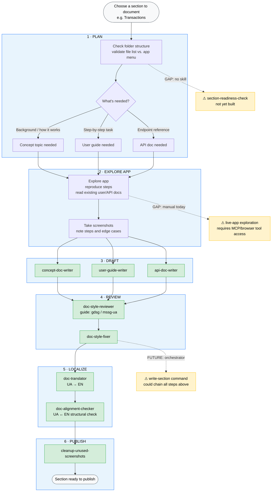

# TW Workflow Map

Personal reference: your real process stages mapped to toolkit skills. Use this to decide which skill to invoke next, and to spot where you still work manually.

---

---

## Skill quick reference

| Stage | Skill / Command | What it does |
|---|---|---|
| Draft — concept | `concept-doc-writer` | Background topics: how a feature works, what a term means |
| Draft — user guide | `user-guide-writer` | Task-based procedural docs for partner cabinet |
| Draft — API | `api-doc-writer` | One endpoint per page, API reference format |
| Review style | `doc-style-reviewer` | Read-only findings report (gdsg / mssg-ua / ua-grammar) |
| Fix style | `doc-style-fixer` | Applies the reviewer's findings to the file |
| Translate | `doc-translator` | UA → EN, preserves MDX, enforces EN glossary |
| Alignment check | `doc-alignment-checker` | Checks UA and EN pages are structurally in sync |
| Clean screenshots | `cleanup-unused-screenshots` | Moves unreferenced screenshots to `_unused/` |

## Commands quick reference

| Command | Underlying skill |
|---|---|
| `/doc-from-interview` | `convert-sme-input` → `user-guide-writer` |
| `/create-api-doc` | `api-doc-writer` |
| `/review-doc-style` | `doc-style-reviewer` |
| `/fix-doc-style` | `doc-style-fixer` |
| `/fix-doc-todos` | resolves `{/* ToDo */}` markers |
| `/translate-doc` | `doc-translator` |
| `/check-doc-alignment` | `doc-alignment-checker` |

## Gaps (not yet built)

| Gap | Why it matters | What it would need |
|---|---|---|
| `section-readiness-check` | Step 1 is manual today — you eyeball the folder | Skill that reads a section folder, lists stubs vs. complete files, outputs a gap report |
| Live-app exploration | `extract-sme-screenshots` only handles meeting recordings; app exploration is fully manual | MCP or browser tool access to the target app |
| `write-section` orchestrator | Your eventual goal: one command → ready-to-publish | Coordination skill that chains readiness check → writer → style review → translate → align |
