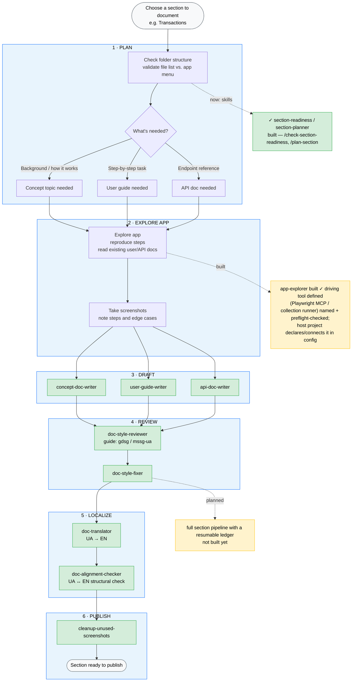

# TW Workflow Map

Personal reference: your real process stages mapped to toolkit skills. Use this to decide which skill to invoke next, and to spot where you still work manually.

---

```mermaid
flowchart TD
    START([Choose a section to document\ne.g. Transactions]) --> STRUCT

    subgraph PLAN["1 · PLAN"]
        STRUCT[Check folder structure\nvalidate file list vs. app menu]
        STRUCT --> FILETYPE{What's needed?}
        FILETYPE -->|Background / how it works| CONCEPT_NEEDED[Concept topic needed]
        FILETYPE -->|Step-by-step task| GUIDE_NEEDED[User guide needed]
        FILETYPE -->|Endpoint reference| API_NEEDED[API doc needed]
    end

    subgraph EXPLORE["2 · EXPLORE APP"]
        CONCEPT_NEEDED & GUIDE_NEEDED & API_NEEDED --> APPEXP[Explore app\nreproduce steps\nread existing user/API docs]
        APPEXP --> SCREENS[Take screenshots\nnote steps and edge cases]
    end

    subgraph DRAFT["3 · DRAFT"]
        SCREENS --> WRITE_C[concept-doc-writer]
        SCREENS --> WRITE_G[user-guide-writer]
        SCREENS --> WRITE_A[api-doc-writer]
    end

    subgraph REVIEW["4 · REVIEW"]
        WRITE_C & WRITE_G & WRITE_A --> STYLE_R[doc-style-reviewer\nguide: gdsg / mssg-ua]
        STYLE_R --> STYLE_F[doc-style-fixer]
    end

    subgraph LOCALIZE["5 · LOCALIZE"]
        STYLE_F --> TRANSLATE[doc-translator\nUA → EN]
        TRANSLATE --> ALIGN[doc-alignment-checker\nUA ↔ EN structural check]
    end

    subgraph PUBLISH["6 · PUBLISH"]
        ALIGN --> CLEANUP[cleanup-unused-screenshots]
        CLEANUP --> DONE([Section ready to publish])
    end

    %% Gap annotations
    STRUCT -.->|now: skills| DONE1["✓ section-readiness / section-planner\nbuilt — /check-section-readiness, /plan-section"]
    APPEXP -.->|built| GAP2["app-explorer built ✓ driving tool defined\n(Playwright MCP / collection runner) named + preflight-checked;\nhost project declares/connects it in config"]
    STYLE_F -.->|planned| GAP3["full section pipeline with a resumable ledger\nnot built yet"]

    classDef skill fill:#d4edda,stroke:#28a745,color:#000
    classDef gap fill:#fff3cd,stroke:#ffc107,color:#000
    classDef stage fill:#e8f4fd,stroke:#0d6efd,color:#000
    classDef terminal fill:#f8f9fa,stroke:#6c757d,color:#000

    class WRITE_C,WRITE_G,WRITE_A,STYLE_R,STYLE_F,TRANSLATE,ALIGN,CLEANUP,DONE1 skill
    class GAP2,GAP3 gap
    class PLAN,EXPLORE,DRAFT,REVIEW,LOCALIZE,PUBLISH stage
    class START,DONE terminal
```

---

## Skill quick reference

| Stage | Skill / Command | What it does |
|---|---|---|
| Readiness check | `section-readiness` | Classifies a section folder (skeleton / needs-revision / greenfield), emits a JSON verdict |
| Explore app | `app-explorer` | Explores the live app + API-seeded state, writes `.sources/app-notes.md` |
| Plan section | `section-planner` | Proposes IA (keep/merge/split/add) for a section, gated on approval |
| Draft — concept | `concept-doc-writer` | Background topics: how a feature works, what a term means |
| Draft — user guide | `user-guide-writer` | Task-based procedural docs for partner cabinet |
| Draft — API | `api-doc-writer` | One endpoint per page, API reference format |
| Update a page | `doc-page-updater` | Applies a change brief to an approved page with the smallest edit; writes update-report.md for the scoped review / sync translation that follow |
| Resolve markers | `resolve-markers` | Batch-answers `{/* NEEDS CONFIRMATION */}` markers from evidence |
| Review style | `doc-style-reviewer` | Read-only findings report (gdsg / mssg-ua / ua-grammar) |
| Fix style | `doc-style-fixer` | Applies the reviewer's findings to the file |
| Translate | `doc-translator` | UA → EN, preserves MDX, enforces EN glossary |
| Alignment check | `doc-alignment-checker` | Checks UA and EN pages are structurally in sync |
| Clean screenshots | `cleanup-unused-screenshots` | Moves unreferenced screenshots to `_unused/` |
| Full page pipeline | `doc-from-interview` | Orchestrates the full per-page pipeline from SME video to style-reviewed draft |
| Fix link TODOs | `fix-doc-todos` | Resolves link-type `{/* ToDo */}` markers across the project |

See [`SKILLS-INDEX.md`](plugins/doc-writer-toolkit/SKILLS-INDEX.md) for the canonical list with invocation examples.

## Commands quick reference

| Command | Underlying skill |
|---|---|
| `/doc-from-interview` | `convert-sme-input` → `user-guide-writer` |
| `/create-api-doc` | `api-doc-writer` |
| `/check-section-readiness` | `section-readiness` |
| `/plan-section` | `section-planner` |
| `/explore-and-resolve` | `app-explorer` → `resolve-markers` |
| `/review-doc-style` | `doc-style-reviewer` |
| `/fix-doc-style` | `doc-style-fixer` |
| `/fix-doc-todos` | resolves `{/* ToDo */}` markers |
| `/translate-doc` | `doc-translator` |
| `/check-doc-alignment` | `doc-alignment-checker` |
| `/update-doc-page` | `doc-page-updater` |

## Gaps (setup requirements)

| Gap | Why it matters | What it needs |
|---|---|---|
| Live-app driving tool | `app-explorer` names its driving tool (Playwright MCP / collection runner) and preflight-checks it; what remains is wiring the actual MCP server + runner into the host project and declaring them in its config | Playwright MCP server + collection runner connected in the session and declared in the host project's "Documentation toolkit configuration" |
