# How the section tool works — a simple picture

You point at a folder. The tool goes through six steps. It stops and asks you **once**, in the middle, before it writes anything.

```mermaid
flowchart TD
    START([You: 'document the transactions folder']) --> P1

    P1["📋 STEP 1 — Look around<br/>What pages already exist here?<br/>Which are finished, which are empty?<br/>What videos/notes/screenshots do we have?<br/>Overall: is this section blank, half-done, or empty?"]
    P1 --> P2

    P2["🔍 STEP 2 — Explore the app<br/>Open the real app, click through it,<br/>set up test transactions,<br/>take fresh screenshots"]
    P2 --> P3

    P3["🗂️ STEP 3 — Make a plan<br/>'Here's what I think this section needs:<br/>1 overview page, 3 how-to guides.<br/>These 2 should be separate. OK?'"]
    P3 --> GATE

    GATE{{"✋ IT STOPS HERE<br/>and shows you the plan.<br/>Nothing is written yet.<br/>You say yes / change it."}}
    GATE -->|You approve| P4

    P4["✍️ STEP 4 — Write each page<br/>For every page in the plan:<br/>write it → check it against your<br/>style guide → fix what it can →<br/>drop in the screenshots"]
    P4 --> P5

    P5["🧹 STEP 5 — Tidy up<br/>Put unused screenshots aside<br/>(never deletes them)"]
    P5 --> P6

    P6["📄 STEP 6 — Tell you what happened<br/>'Wrote 4 pages. 2 things I couldn't<br/>figure out — you decide these.<br/>Here's everything I changed.'"]
    P6 --> DONE([Pages ready for you to review & publish])

    classDef step fill:#e8f4fd,stroke:#0d6efd,color:#000
    classDef gate fill:#fff3cd,stroke:#ffc107,color:#000
    classDef done fill:#d4edda,stroke:#28a745,color:#000

    class P1,P2,P4,P5,P6 step
    class P3,GATE gate
    class START,DONE done
```

## The one idea that matters most

The tool **never writes pages behind your back.** It looks around, explores, and makes a plan — then it *stops* and shows you the plan. Only after you say "yes" does it start writing. That yellow "It stops here" box is your control point.

## Where we are right now

Of those six steps, only the **first one is built** so far — "Look around."

When you run it, it won't write any pages. It just makes a short report, something like:

> *"This folder has 4 pages. 1 looks finished, 3 are empty. There's a video and 12 screenshots. The app is reachable. Overall: this section is half-done and needs revision."*

That last line — **blank / half-done / empty** — tells you which situation you're in at a glance:

- **Blank** — the pages exist but are empty shells. The structure might even be wrong; only checking the app can tell.
- **Half-done** — real content exists, just needs fixing (merging pages, filling gaps, style check).
- **Empty** — just a folder, nothing inside. Needs full investigation from the app and other sources.

That report is the foundation the other steps read from. It's small on purpose — cheap to try, easy to see if it got things right.

## What's built and what's not

| Step | Built? |
|---|---|
| 1 — Look around | ✅ Done (not pushed yet) |
| 2 — Explore the app | ⬜ Not yet |
| 3 — Make a plan | ⬜ Not yet |
| 4 — Write each page | ⬜ Not yet (uses tools that already exist) |
| 5 — Tidy up | ⬜ Not yet (tool already exists, needs wiring in) |
| 6 — Tell you what happened | ⬜ Not yet |
