# Step 1 in detail — "Look around" (section-readiness)

This is the full picture of what Step 1 does inside. It's a **stocktake**: it reads, counts, labels, and writes one report. It never edits your docs.

```mermaid
flowchart TD
    START([You run: /check-section-readiness docs/transactions]) --> CFG

    subgraph SETUP["First — learn the project's settings"]
        CFG["Read the project's CLAUDE.md settings:<br/>• what language you write in<br/>• where docs live<br/>• is the app reachable?<br/>• is a test-data tool set up?"]
        CFG --> MISSING{"Anything it<br/>needs missing?"}
        MISSING -->|Yes| ASK["❓ Ask you ONCE<br/>(the only question in Step 1)<br/>and offer to save the answer"]
        MISSING -->|No| EXISTS
        ASK --> EXISTS
    end

    EXISTS{"Does the folder<br/>actually exist?"}
    EXISTS -->|No| STOP["🛑 Stop and say so.<br/>Nothing to look at.<br/>Does NOT create the folder."]
    EXISTS -->|Yes| SCAN

    subgraph LOOK["Then — look around (reading cheaply, never full pages)"]
        SCAN["List every page in the folder<br/>(including subfolders)"]
        SCAN --> SOURCES["Inventory raw materials in .sources / .assets:<br/>videos · transcripts · notes ·<br/>screenshots · earlier reports"]
        SOURCES --> MARKERS["Count the 'come back to this' notes<br/>in each page (a quick scan, not a full read)"]
    end

    MARKERS --> LABEL

    subgraph JUDGE["Then — label what it found"]
        LABEL["For each page, decide:<br/>EMPTY (blank shell / template / mostly notes)<br/>or FINISHED (real content)<br/>+ one-line reason + a guess at page kind"]
        LABEL --> VERDICT["Give the whole section ONE verdict:<br/>🟨 skeleton — pages exist but empty<br/>🟧 needs-revision — real drafts, need fixing<br/>⬜ greenfield — just a folder, nothing inside"]
        VERDICT --> APP["Check app-access (does NOT open the app):<br/>• live app reachable? yes/no<br/>• test-data tool set up? yes/no<br/>• explored this app before? yes/no"]
    end

    APP --> WRITE

    subgraph OUT["Finally — report (the only thing it writes)"]
        WRITE["Save the report:<br/>.sources/section-readiness.json"]
        WRITE --> TELL["Tell you on screen in 2–3 lines:<br/>verdict + page counts + what sources exist"]
    end

    TELL --> DONE([Done. No pages written. No screenshots moved.])

    classDef setup fill:#f3e8fd,stroke:#8b5cf6,color:#000
    classDef look fill:#e8f4fd,stroke:#0d6efd,color:#000
    classDef judge fill:#fff3cd,stroke:#ffc107,color:#000
    classDef out fill:#d4edda,stroke:#28a745,color:#000
    classDef stop fill:#f8d7da,stroke:#dc3545,color:#000
    classDef ask fill:#ffe5b4,stroke:#fd7e14,color:#000

    class CFG setup
    class SCAN,SOURCES,MARKERS look
    class LABEL,VERDICT,APP judge
    class WRITE,TELL out
    class STOP stop
    class ASK ask
    class START,DONE out
```

## The rules Step 1 lives by

**It only reports what EXISTS — never what's missing.**
It won't say "you're missing a refunds guide." Saying what *should* be there needs a plan, and that's Step 3's job. Step 1 sticks to facts it can see.

**It reads cheaply.**
It never dumps whole pages into its thinking. For labelling a page it reads the top (the settings block) plus a small sample — enough to tell empty from finished. For screenshots it reads the little index file, not the images. This keeps runs fast and cheap.

**It doesn't open the app.**
When it says "app reachable," it's only reading your settings — it does not actually launch anything or take screenshots. That's a later step.

**It asks you at most once.**
Only if a required setting is missing. Otherwise it's silent until the report.

**It writes exactly one file.**
`section-readiness.json`, inside the section's `.sources/` folder. Nothing else is created, moved, or edited. That's why it's completely safe to run.

## The two labels, explained

| Label | What it means |
|---|---|
| **EMPTY** (stub) | The page is a blank template, placeholder text, or mostly "come back to this" notes. |
| **FINISHED** (complete) | The page has real sentences and real steps — actual content. |

The tool also **guesses** each page's kind (overview / how-to / API), but it's allowed to say "not sure" — the real decision comes later, so a wrong guess here costs nothing.

## The one verdict for the whole section

| Verdict | Meaning | Which of your test sections |
|---|---|---|
| 🟨 **skeleton** | Pages exist but are empty shells. Structure might be wrong — only the app can confirm. | Your blank-files section |
| 🟧 **needs-revision** | Real drafts exist, just need fixing. | Your near-complete section |
| ⬜ **greenfield** | Just a folder, nothing inside. Needs full investigation. | `balance` |
