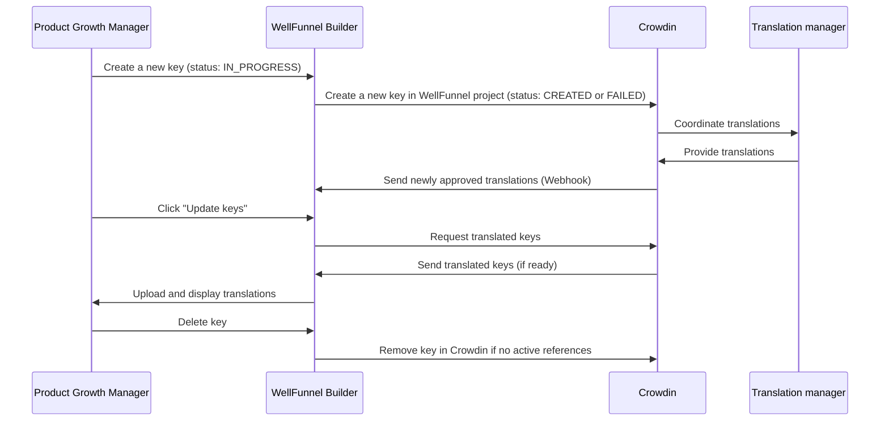

Text on the onboarding and payment [screens](/docs/wellfunnel-builder/screens/screens-overview.md) needs to appear in the corresponding language based on the user's browser location settings. To achieve this, WellFunnel (WF) has the *Localizations* feature, which lets you create localization keys for translating texts into the required languages. After creation, these keys are sent to Crowdin—a third-party tool used by translation managers—through API calls for translation. Upon completion of the translations in Crowdin, they are imported back into WF Builder for use on various screens.

The Localizations feature supports translations into several languages: English (EN), German (DE), French (FR), Italian (IT), Portuguese (PT), Spanish (ES), Japanese (JA), Korean (KO), Turkish (TR), and Polish (PL). The following example shows how the same screen looks for users from different locales:


## Localization page

The **Localization** page has a table with a list of all keys. On this page, you can view, create, update, and delete localizations.
The table has the following fields:

- **ID**: Localization key's unique ID, assigned automatically after key creation.
- **Key**: Unique identifier for WF Builder, which recognizes specific text.
- **Text**: English text value for the key, which can be immediately used as the EN value after key creation. It serves as the primary reference for the translation manager for translation into other languages.
- **Available translations**: Lists countries (country codes) to which the text was translated. These translations are eventually shown to users on the onboarding and payment screens. If all locales are available, you see the **All** tag.
- **Status**: Localization key status. Possible statuses:
  - **IN_PROGRESS**: The key is currently being created in Crowdin or processed by the system.
  - **CREATED**: The key was created successfully in Crowdin and is ready for translations.
  - **FAILED**: The creation or synchronization with Crowdin failed, requiring manual intervention or a retry.
- **Screen counter**: Displays the number of screens that use a key and also lets you view and open those screens.
- **Actions**: Lets you view information about localization keys, view their logs, and delete unused keys.

<details>
<summary>Localization page in WellFunnel</summary>


</details>

## Localization request flow

The following flowchart shows the localization request flow:

```mermaid
sequenceDiagram
    participant PGM as Product Growth Manager
    participant Figma
    participant TranslationMgr as Translation Manager
    participant LocTeam as Localization Team
    participant WellFunnel as WellFunnel Localization
    participant CrowdIn
    participant WFT as WellFunnel Team
    participant SQS as Amazon SQS

    %% Step 1-2: Decide to change or add content and optional Figma design
    Note over PGM,Figma: Decide to update content & design flow (optional)
    PGM->>Figma: Finalize flow design (with context text)
    
   ...
```

1. A *product growth manager (PGM)* decides to change or add content for testing purposes or to launch new directions, such as new branches or audiences, or to start a new funnel test.  
2. Optional: The PGM can use existing template designs in Figma and add the necessary text to better explain the context.  
3. After finalizing the flow in Figma, the PGM creates a task for the translation manager, requesting a proofreading check for specific texts they intend to add. The texts can be provided in a spreadsheet or a Figma file.
4. After proofreading is completed and approved by the localization team, the PGM can create all translations in the WellFunnel localization section.  
5. After creating new keys, the PGM should notify the translation manager in Asana, listing the new key names and requesting translations. The task should include all required screenshots for reference.  
6. After receiving a notification that the keys have been translated, the PGM can manually sync translations in the WellFunnel localization section to pull all languages from CrowdIn. Additionally, an automatic translation sync runs in the background.  
7. Once all translations—or the specific ones required for a project—are received, the translation is considered ready to use.  
8. If, while creating the flow, the PGM confirms that there are enough keys and localizations, they follow the standard process for funnel launch.  
9. If the PGM notices that not all required locales are covered by WellFunnel, they request a new feature from the WellFunnel team.  
10. If, during the creation of the flow, the PGM identifies missing localizations, they request new translations.  
11. After receiving the notification about new key creation, the translation manager processes the translations asynchronously using Amazon Simple Queue Service (SQS) and notifies the requestor in the same Asana task once translations are ready.  

:::info

PGM can add untranslated keys to screens in advance so that they sync later. It automatically creates translations wherever this key is used.

:::

## Locale handling rules

To ensure localization flexibility across all Welltech products, the following rules apply when WF Builder responds to a request for text in a specific language:

1. If the request from WF Studio comes from one of the supported locales, WellFunnel tries to return the text in the requested language.
2. If the requested key does not have a corresponding translation for the locale, WellFunnel returns the English (EN) value as a fallback.
3. If no English value exists for the key, WellFunnel returns the key name itself as the final fallback.
4. If the request from WF Studio is *not* from a supported locale, WellFunnel returns the English (EN) value as the default.

These rules ensure that users in all regions supported by WellFunnel receive appropriate localizations or fallbacks without breaking the flow.

## Asynchronous localization update system

WellFunnel uses a new asynchronous update system to ensure that large volumes of localization updates are handled efficiently. Localization updates are processed in the background, allowing the system to scale for future growth in supported languages and update requests. The flow includes the following steps:

1. **Request initiation**: When multiple localization keys are updated, the system immediately returns a job ID instead of waiting for the update to complete.
2. **Status check**: An API endpoint lets users check the status of their ongoing update jobs.
3. **Audit logging**: All localization updates are logged, capturing details such as the key, text, and languages involved. This ensures that any translation-related issues can be traced back for investigation.
4. **Error handling and retries**: If a localization update fails, the system retries the process. Errors are also logged, allowing administrators to intervene if necessary.

## Keys usage and testing

1. Upon receiving the update from the translation manager, the PGM updates the relevant keys in WellFunnel and uploads all translations. Subsequently, these keys can be used in new screens.
2. After creating the flow, the PGM conducts monetization tests.
3. If the test is successful, the resulting link can be incorporated into the *User Acquisition (UA)* flow.
4. In case of any translation-related errors, the PGM informs the translation manager about these issues in the same Asana task used previously for arranging the translations. Once resolved, the PGM updates the keys in WellFunnel, and the monetization test is conducted again. If this test proves successful, the link can be used in the UA flow.

:::note

This step applies if the WellFunnel localization section indicates that key creation was successful. There is a known issue where requesting many translations at once or experiencing a response delay can cause errors during key creation in CrowdIn. In such cases, the PGM can manually delete the erroneous translation and submit a new request.

:::

## Localization in Crowdin

In Crowdin, the localization process follows these steps:



1. A PGM [creates a new key](/docs/wellfunnel-builder/localizations/manage-in-wellfunnel/create-localization-keys.md) in WellFunnel (WF) Builder: 
   - The key enters the `IN_PROGRESS` status.
   - WellFunnel attempts to create the key in Crowdin through the Crowdin API.  
   - On success, the status changes to `CREATED`; if it fails, the status is `FAILED`, requiring manual intervention.
2. Crowdin receives the new key, and the translation manager coordinates all necessary translations, working with translation specialists.
3. Once translated, Crowdin sends newly approved translations back to WellFunnel through a webhook, and WF Builder updates local data automatically.
4. The PGM [updates the key](/docs/wellfunnel-builder/localizations/manage-in-wellfunnel/update-localization-keys.md) in WF Builder, triggering WellFunnel to fetch translated keys from Crowdin.
5. If the translations are ready, WellFunnel uploads them and displays the updated translations in WF Builder.
6. If the user removes a key from WellFunnel, WellFunnel also deletes that key in Crowdin, provided it's not used in any active screens.  
7. If a key is deleted directly in Crowdin, a webhook notifies WellFunnel. WellFunnel logs the event but doesn't automatically remove the key from its database; an administrator can review this event and proceed accordingly.

## Key name generation

When you create a new key, the system automatically generates its name using a two-part process: *`SLUG`_`RANDOM_STRING`*.

Each part is constructed as follows:

* *`SLUG`*: Slug generated from the text entered in the **EN value** field. Spaces and special characters are replaced with underscores to create a simplified version of the text. The slug is then truncated to a maximum length of 34 characters.
* *`RANDOM_STRING`*: Randomly generated 5-character string composed of lowercase ASCII letters and digits, with each character chosen with equal probability to ensure uniqueness.

**Example:**

If the **EN value** field has the `let's see what this post request does` value, the generated key might look like `let_s_see_what_this_post_request_cpadn`, where `let_s_see_what_this_post_request` is the slug and `cpadn` is the randomly generated string.

### Complex key usage example

Sometimes, a complex key containing a variable or data from the onboarding sequence is necessary. These keys are created for specific templates and must adhere to pre-established logic—for example, `"{ discount }% discount reserved for"`.

This key on the payment timer displays a dynamic discount based on selected products. Although you can't create such values independently, they can be used in other translations for the same template—for example, `If you skip the trial and start your plan today, we'll refund your trial payment and take an extra {discount}% off your total`. For details about Translations wrapper keys, see [Translations wrapper](/docs/wellfunnel-studio/templates/translations-wrapper/translations-wrapper.md) and [Translation key variables](https://welltech.atlassian.net/wiki/spaces/WD/pages/5118853246/Translation+key+variables).

:::warning

WellFunnel has a unified database for keys in both the *staging (stage)* and *production (prod) environments*.
As a result, if you create a key in the stage environment, you can't duplicate it in the prod environment.
Therefore, create real keys only in prod and use the stage environment for test keys.

Also, to prevent issues with links used in marketing, avoid modifying existing prod keys.

:::

## Next steps

* [Create localization keys](/docs/wellfunnel-builder/localizations/manage-in-wellfunnel/create-localization-keys)
* [Delete localization keys](/docs/wellfunnel-builder/localizations/manage-in-wellfunnel/delete-localization-keys)
* [Update localization keys](/docs/wellfunnel-builder/localizations/manage-in-wellfunnel/update-localization-keys)
* [View localization keys](/docs/wellfunnel-builder/localizations/manage-in-wellfunnel/view-localization-keys)
* [View localization key audit logs](/docs/wellfunnel-builder/localizations/manage-in-wellfunnel/view-localization-key-audit-logs)