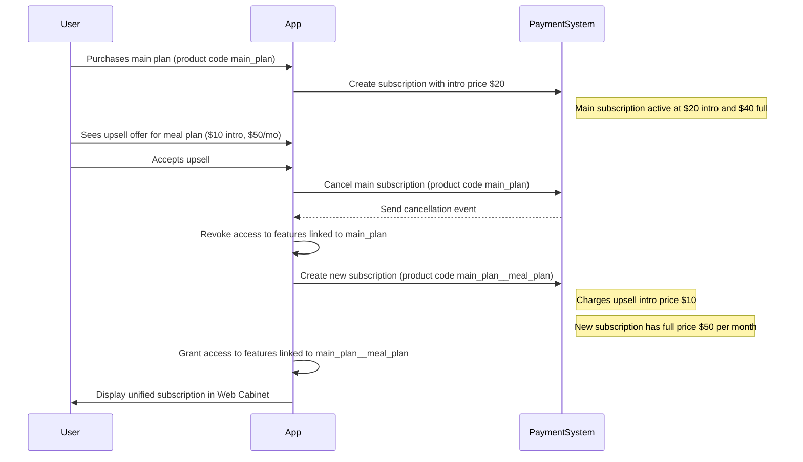

The *Upsell upgrade subscription* feature manages subscription logic when users upgrade their main subscription by purchasing an upsell. Although the process appears seamless to users, it involves several behind-the-scenes steps, including subscription cancellation, re-creation, and price recalculation. This document explains how the feature works, including the user experience, system behavior, configuration requirements, and a representative use case for implementing upsell-based subscription upgrades.

Before proceeding, review the following documents to understand the core components involved in the upgrade flow:
- [Product codes](/docs/wellfunnel-builder/product-codes/product-codes-overview.md): Explains the role of unique product identifiers, which are critical for feature entitlement and correct subscription management when transitioning between plans.
- [Product plans](/docs/wellfunnel-builder/product-plans/product-plans-overview.md): Describes subscription configuration specifics, including plan durations, pricing, and more.

## User-side upgrade flow

When users purchase an [upsell](/docs/wellfunnel-builder/product-plans/product-plans-overview.md#product-tags), the process is straightforward:

- After purchasing the main product, users are directed to the upsell screen, which suggests subscribing to extra features—such as breathing exercises or a meal plan—as a recurring add-on to their existing subscription.
- Users accept the offer and purchase the upsell as a recurring add-on to the current subscription.
- When the payment flow is completed, the user is automatically logged in to their web cabinet, where they see a single active subscription. The main product and upsell appear as a single subscription in the UI.
- Each component generates a separate receipt, but they are merged visually in the UI.
- When the user cancels the subscription, both the main and upsell components are canceled. The upgraded plan is treated as a single subscription, and cancellation revokes access to both the main and upsell features.

## System-side upgrade flow

On the payment system side, the upgrade process is more complicated:

- When a user purchases an upsell, the payment system automatically and instantly cancels the current subscription.
- An updated intro and full prices are assigned to the new subscription. The prices are calculated as the difference between the new and old product plan prices. Each price is manually calculated and set by a PGM when they create product plans for the flow. The system only switches from one product plan to another at the moment of the purchase of the upsell.
- A new subscription with a distinct product code replaces the original one. The product code includes feature sets from both the main product and the upsell. The PGM defines this product code when configuring the flow.
- The user is billed the full price of the new product plan at each recurring period.

## Configuration aspects

To implement the flow, consider the following when setting up the payment flow:

- **Product codes must be different.** Because payment providers (Solidgate, Inary) don't support merging subscriptions natively, the entire flow is simulated through cancel-and-replace logic. This distinction ensures correct feature revocation and access granting during the transition from the canceled to the new subscription. Thus, when creating a product code for the upsell, it must include the same features as the main product’s code, plus access to extra features that the upsell itself is supposed to unlock.
- **All pricing values must be configured manually.** There is no automated validation for intro price differences or pricing mismatches. It is the responsibility of the Product Growth Manager (PGM) to ensure price logic consistency during product plan creation.
- **Periods of the main product and upsell must be compatible.** Intro and subscription periods of the main product and upsell must be either identical or the upsell must have a longer period. For example, if the main product has one-month intro and one-month subscription periods, then the upsell must have either the same periods or longer ones, such as three months for intro and three months for subscription.
- **Each scenario requires a separate product plan.** Each upgrade scenario must be implemented as a separate product plan with a separate product code that includes both the main product features and upsell features. This ensures proper mapping of feature access through product codes because access revocation on cancellation is based on the product code tied to the main product.
- **Subscription upgrades are limited.** Each payment flow may include only one upgrade option.
- **Standalone upsells are not allowed.** Upsell must be offered contextually as upgrade flows. They can't be offered before the main product or as a standalone product, without a preceding main product.

:::info[System restrictions]

- Users can only have one upsell.
- The upsell can only happen before the first rebill of the initial subscription.
- Existing users (older than one month) can't purchase an upsell.

:::

## Use case

This section describes a use case where a PGM configures a payment flow involving a main product and an upsell that adds a meal plan and extends the billing period.
A user then upgrades their existing subscription by purchasing the upsell. 

:::note

For clarity purposes, this use case demonstrates a simplified scenario.
WF Builder also supports more advanced setups—for example, cases where the main and upsell products have different intro or full periods.

:::

### Configuration phase

You configure a payment flow with a main product and an upsell for Muscle Booster. 
Goal: sell the feature (meal plan upsell) for an additional $10 per month.

The product plans are configured as follows:

| Product type | Product plan type | Periods and prices | Product code assigned  | Comments |
|---|--|---|---|---|
| Main | Subscription  | One-month intro: $20, One-month full: $40 | `main_plan`–unlocks access to the app's main features |When the user purchases a main plan, they are charged an intro price and are suggested an upsell. If they skip the upsell, the main product's product plan is applied .|
| Upsell| Subscription | One-month intro: $10, One-month full: $50 | `main_plan__meal_plan`–unlocks access to the app's main features and meal plan features | <ul><li>**One-month intro:** The user purchases the main product before being offered the upsell, so the upsell intro price includes only an extra payment for getting the meal plan as an additional feature.</li><li>**One month full:** The upsell full plan includes both the pricing and feature sets of the main product and the upsell. This configuration is required because the original plan is canceled, and the new plan restores the main features and adds upsell access.</li></ul>. |

:::note

When configuring a flow, it is your responsibility to calculate the correct prices for product plans and assign the appropriate product codes. The system doesn't automatically validate errors in product code or product price configuration.

:::

### Purchase phase 

The user begins by purchasing the main product plan with a 31-day subscription period. The intro price is $20, and the recurring full price is $40 per billing cycle. After the initial purchase, the user is shown an upsell screen that offers to add a meal plan. This upsell is priced at $10 during the intro period and $50 for every billing cycle (each month) thereafter. This new subscription uses a different product code that grants access to the combined feature set (main + upsell).

The upsell price is calculated as follows:

- **Intro price**: *$10*—an extra payment now for getting a meal plan as an additional feature to the main.
- **Full price per month**: *$50*-the amount the user pays every month, which consists of the price to access the app's main features ($40) and meal plan features ($10).

This means the user pays $30 during the funnel ($20 on the main product screen and $10 on the upsell screen) and $50 every next month.

From the user's perspective, they don't see any disruption; they continue with a single subscription experience and are redirected to their web cabinet. The cabinet's interface reflects one active plan with an updated summary:
- **Active payment:** Reflects the sum of the main plan intro price and upsell intro price ($30 in this case).
- **Upcoming payment:** Reflects the full price from the upsell subscription ($50 in this case).

Although receipts are technically split by the payment system—one per product plan—the UI merges them under a unified product code.

If the user cancels the subscription at any point, the cancellation revokes access to both the main and upsell features, as the combined subscription is treated as one. There is no partial cancellation mechanism for upsell components.

The following diagram demonstrates this subscription upgrade process:

## Related documents

- [Product codes](/docs/wellfunnel-builder/product-codes/product-codes-overview.md)
- [Product plans](/docs/wellfunnel-builder/product-plans/product-plans-overview.md)