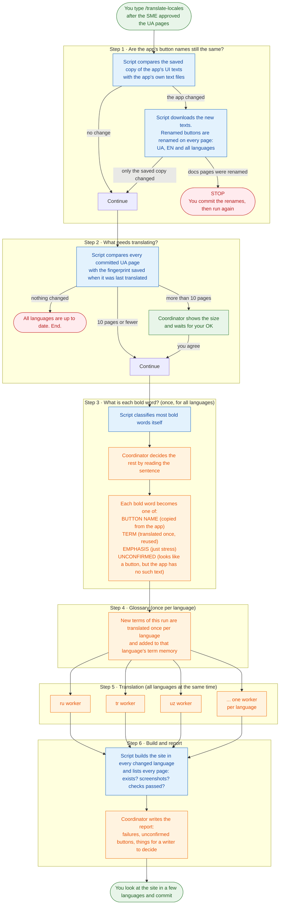
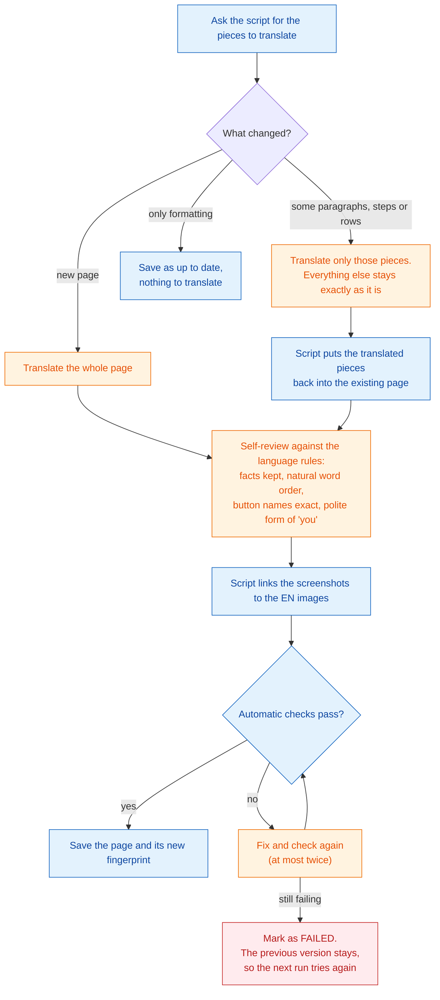
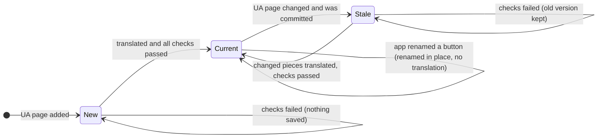

# How locale-translator works

A plain-language guide to `/translate-locales`. Read it to refresh how the translation works, to learn it for the first time, or to see what a change would affect before you improve it. Claude doesn't load this file when it runs the skill. The rules it follows are in `SKILL.md`, `worker.md` and `context/locale-translation.md`.

## The idea in one paragraph

After an SME approves a Ukrainian (UA) page, the page is translated into every further language the site declares (for example `ru`, `tr` or `es`). EN isn't one of them: `doc-translator` handles it separately. **No one reviews these translations.** Instead, correctness comes from a mechanism:

- Button and field names are copied from the app's own text files, so they are never guessed.
- Each domain word is translated once per language and reused on every page.
- Scripts decide what changed and check every translated page.
- A page that fails a check isn't saved.

Claude only does what needs language skills: deciding what a bold word is and translating text.

## Who does what

| Part | Is it AI? | Job |
|---|---|---|
| **`ui-labels` script** | No | Keeps a copy of the app's UI texts in every language (the **label store**), notices when the app renamed a button, and renames it on every docs page. |
| **`locale-sync` script** | No | Finds which pages changed, cuts out exactly the changed pieces, puts translated pieces back, links screenshots, runs the checks and saves progress. |
| **Coordinator** (the Claude session where you type `/translate-locales`) | Yes | Runs the steps in order, decides what each bold word means, translates new terms, starts the workers and writes the report. It never translates pages itself. |
| **Workers** (one Claude helper per language, running in parallel) | Yes | Translate the pages of one language, check each one, save the ones that pass. |
| **You** | — | Start the run after SME approval, answer when asked, review the site visually, commit. |

## Recommended model and effort

| What you're doing | Session (coordinator) | Workers | Why |
|---|---|---|---|
| A normal run: first run, new or changed pages | **Opus, high effort** | **Sonnet** (`--worker-model sonnet`) | The coordinator makes the judgment calls that every language inherits: which bold word is which button, and the glossary. A wrong call there spreads to every language, with no reviewer to catch it. Workers follow rules and get exact strings from the scripts. Translated side by side on the same pages, Sonnet workers matched Opus, for far less. |
| Corrections after a run (a term, a button in one section, titles) | **Opus, high effort** | **Sonnet** | Deciding which lines need a redo, and what the correct term is, needs judgment. The rewrite itself is small. |
| `--dry-run` (only "what would be translated?") | Any model, low effort | None | Only scripts run. Claude shows their table. |
| The label check at the start of a writer skill | Whatever that skill uses | None | Scripts only. No AI is involved. |

How to set it:

1. In the docs repo, type `/model`, pick **Opus** and set the effort to **high**.
2. Run `/translate-locales --worker-model sonnet` (add your pages or `--locales` as usual).

Run it wherever you use Claude Code in that docs repo, either the VS Code panel or a terminal. A docs repo installs the plugin from its marketplace through its `.claude/settings.json`. A terminal with `claude --plugin-dir <path>` is only needed to try plugin changes that aren't merged yet. After a plugin update is merged, refresh the installed copy (`/plugin` → marketplace → update) and start a new session.

Without `--worker-model`, the workers use the session's model. With Opus that means one Opus worker per language, all in parallel, which costs several times more for no measurable gain. The skill doesn't set the workers' effort, so they run at their default.

## The whole run

Colours: **blue** is a script (no AI), **orange** is Claude, **green** is you, **red** is where a run ends early.

### The steps in words

1. **Button names.** The app's UI texts (the frontend's locale files on the branch the docs repo declares, plus the ticket's feature branch if there is one) are compared with the saved copy in the docs repo. If the app renamed a button that the docs mention, the script renames it on every page in every language. Then the run stops so you can commit that rename first. Otherwise the renamed page would look changed and be translated again in full.
2. **What changed.** Only **committed** UA text counts. A page is translated when it's new, or when it changed since the last translation. On the first run that's every page, so the coordinator asks before starting.
3. **Bold words.** In these docs, bold usually means a button or field name, but not always. Each bold word is classified once, and the decision is saved for the page, so every language follows the same decision. Most cases are decided by the script, for example when the word is in the app's texts and comes right after «натисніть» or «поле». Claude decides the unclear ones. One word can mean different controls in different sections of a page (a tab and a switch both called «Сповіщення»). Then the decision is saved per section.
4. **Glossary.** Each domain term (an entity, a status, a role, or a generic word such as "button" or "field") gets one translation per language, saved in that language's term memory. If the app itself shows that word, the app's text wins.
5. **Translation.** One worker per language, all running at the same time. Each one goes through its pages one at a time (see the next diagram). If one language fails, the others continue.
6. **Build and report.** The site is built per language, so broken links and missing images show up. The report lists every page × language with ✓/✗, the local URLs to look at, and everything that needs a person's decision. **Nothing is committed: you commit.**

## One page, one language: what a worker does

What the worker gets for each piece: the UA text, the exact app text for every button in it, the glossary entries for the words in it, and the translated titles of pages it links to. It reads nothing else: not the EN page, not other languages, not the whole glossary. That keeps every page consistent, and it keeps the run cheap.

### What the automatic checks catch

| Check | Catches |
|---|---|
| Structure, headings, counts | A paragraph split or merged, a missing step, a missing table row, a changed heading level or anchor |
| Button names | A button name that isn't exactly the app's text in that language, or has an ending glued to it |
| Code, links, images, tags | Anything that must stay byte-identical but was changed |
| Markers | A lost `ToDo` or `NEEDS CONFIRMATION` comment |
| Ukrainian letters | Leftover untranslated Ukrainian text |
| Screenshots | An image that doesn't open |
| Frontmatter | A title or description left in Ukrainian |
| Link titles (warning only) | A link that names a page differently from that page's title |

**What no check can catch:** a wrong meaning, an awkward sentence, or a wrong word in prose. That's why a native speaker should look at a few pages now and then, and why fixing a term is a supported operation (see "Fixing a translation after a run" below).

## How it knows what changed

Git gives every committed version of a file a fingerprint (the "blob hash"). When a page is saved for a language, its state file records the fingerprint of the UA page it was translated from. The next run compares that with the current UA fingerprint.

Because the state remembers the **old** UA fingerprint, the script can get the old UA text back from git, compare it with the new one, and give the worker only the paragraphs, steps or rows that differ. A one-word fix in UA re-translates one paragraph, not the page. The pieces are matched to the translation **by position**, which is why the structure check is strict. If a page no longer lines up, its changes are reported as "unmapped" and nothing is written to a guessed place.

Each language has its own state, so one language can be up to date while another is stale.

## Where things are stored

Everything product-specific lives in the docs repo, under `.doc-toolkit/`. The plugin holds only the generic logic.

| What | Where (in the docs repo) | Written by | Committed? |
|---|---|---|---|
| Saved copy of the app's UI texts, all languages | `.doc-toolkit/ui-labels/` | `ui-labels` script | Yes |
| Per-page state: fingerprint per language, bold-word decisions, unconfirmed buttons | `.doc-toolkit/pages/<page>.json` | `locale-sync` script | Yes |
| Glossary per language | `.doc-toolkit/terms/<locale>.tsv` | `locale-sync terms` | Yes. `.gitattributes` merges it without conflicts. |
| Working files of a run (pieces, drafts, results, report) | `.doc-toolkit/.run/<date-time>/` | Coordinator and workers | Never (git-ignored) |
| Translated pages | `i18n/<locale>/docusaurus-plugin-content-docs*/current/` | `locale-sync record` | Yes |
| Sidebar section names | `i18n/<locale>/docusaurus-plugin-content-docs*/current.json` | `locale-sync record` | Yes |
| Screenshots | `.assets/` next to each translated page: links to the EN images, not copies | `locale-sync link-assets` | Yes (as links) |
| Settings: app repo, locale file names, scope | The docs repo's `CLAUDE.md`, "Documentation toolkit configuration" | You, once per repo | Yes |
| Target languages | `docusaurus.config.ts` | You, once per language | Yes |

**Screenshots.** Each language's screenshot is a link to the EN image, so the images are never duplicated. To give a language its own screenshot, replace the link with a real file; the script never touches a real file. If no EN screenshot exists yet, the link points to the UA image and the report says so.

## Using it in a new docs repo

The skill isn't tied to any one project. In a repo that isn't set up, it doesn't guess: it stops, or asks once and offers to save your answer in that repo's `CLAUDE.md`. Nothing is translated until the setup is complete.

| Without this | What happens |
|---|---|
| The plugin installed in the repo (`extraKnownMarketplaces` and `enabledPlugins` in `.claude/settings.json`) | `/translate-locales` doesn't exist there |
| Languages in `docusaurus.config.ts` besides UA and EN | The run stops: "no target locales configured" |
| `UA content root:` and `EN i18n root:` in `CLAUDE.md` | Asks once |
| `App:` and `UI label source:` in `CLAUDE.md` (where the app's text files are: a GitHub repo, branch and folder, or a command that prints them) | Asks once. The run never translates without the app's texts. |
| A matching app text file for every language | Stops and lists the candidate files: you name the mapping in `Locale files:` (for example `uk=ua, es=ar`) |
| `gh` signed in with read access to the app repo | The label check fails and the run stops |
| Allow rules for the two scripts in `.claude/settings.local.json` | Background workers wait for a permission prompt that no one can answer, and that language stalls |

Then the first run translates every page and asks for your OK first. Set the repo up in this order:

1. Add the languages to `docusaurus.config.ts`, and translate the theme strings (`code.json`, navbar, footer) and any site components. That's a one-time job outside the skill.
2. Run `write-translations`, then delete the docs `current.json` files it creates where the sidebar is autogenerated (see `context/project-paths.md`, "Setup note, sidebar labels").
3. Add the fields above to `CLAUDE.md` and the script allow rules to the repo settings.
4. Try `/translate-locales --dry-run`, then a single page in one or two languages, before the full run.

Two assumptions to keep in mind. The source language must be Ukrainian: the rules and the bold-word detection read Ukrainian. And a language that has no row in the rules' tables (polite form, title form, calque traps) is still translated, with the formal "you", and the report flags the missing rows to add.

## Fixing a translation after a run

Saved pages are fixed piece by piece, never by translating the whole page again:

- **A glossary term is wrong** (a native speaker finds it means something else): correct the term, ask the script where the old word is used, and redo just those paragraphs.
- **A bold word should be a different button in one section:** save a decision for that section. The check then points to the lines to redo.
- **A link or page title is in the wrong form:** redo that line.

All of these run through `/translate-locales` in the docs repo. Say what to correct, for example: "locale-translator: correct the tr term «Обліковий запис» and redo the pages that use it."

## Before you change it

Every behaviour has one owner. Change it there, then check the ripple effects in the right-hand column.

| If you change… | Owner file | Watch out for |
|---|---|---|
| The order of steps, when to stop or ask, the report | `SKILL.md` | The self-review list at the end of `SKILL.md` must still match. Users of every docs repo rely on "stop after a label rename". |
| What a worker does per page | `worker.md` | The coordinator's worker prompt in `SKILL.md` (Step 5). Its shared lines come first so they can be reused across workers. Keep the language-specific lines last. |
| Translation rules (style, word order, titles, polite form) | `context/locale-translation.md` | **Only new or changed text follows new rules.** Pages already translated stay as they are until their UA changes, or until you redo them. A rule that must apply everywhere needs a redo of every page. |
| How pages are cut into pieces | `scripts/locale-sync/lib/parse.mjs` | Pieces are matched to old translations **by position**. If the same page now splits differently, saved translations may stop matching: changes become "unmapped" or whole pages are retranslated. Run both test suites and a `--dry-run` on every docs repo that uses the skill. |
| The state file or glossary format | `scripts/ui-labels/lib/`, `scripts/locale-sync/` | A docs repo that already uses the skill holds hundreds of these files. Without a migration, every page looks new: a full, expensive retranslation of all languages. The glossary must stay one line per term, sorted, for the conflict-free merge. |
| What a check accepts | `scripts/locale-sync/` (`check`) | A looser check lets bad pages through with no one noticing. A stricter one can make already saved pages fail on their next update. Run `check` on every docs repo that uses the skill before you merge. |
| How bold words are classified automatically | `scripts/locale-sync/` (`bind`) | Earlier decisions are kept, so the change applies only to new bold words. More automatic decisions save tokens. A wrong automatic decision puts a wrong button name into every language. |
| The recommended models (for example, a cheaper worker or coordinator) | This file, and the `--worker-model` default in `SKILL.md` | Translate the same few pages in two or three languages with the old and new setups, and compare them side by side. A cheaper coordinator can make wrong binding and glossary decisions, and those reach every language. |
| Batch size (8 pages, ~6,000 words) or the 10-page confirmation | `SKILL.md` Step 5 / `status --threshold` | Bigger batches: fewer workers, but a long batch is more likely to break off midway. |
| Adding a language | `docusaurus.config.ts` + `context/locale-translation.md` | Add a row to the polite-form table (§6) and the title-form table (P7), and calque traps (§7) if the language needs them. If the app's file for that language has another name, add it to `Locale files:` in the docs repo's `CLAUDE.md`. The first run then translates every page into the new language. |
| Adding an app (a new docs repo) | That repo's `CLAUDE.md` only | No plugin change: declare the app repo, its locale files and the scope. |

Every script change needs a test: `npm test` in `scripts/ui-labels/` and in `scripts/locale-sync/`. Keep each script's `README.md` in step with it.

## Known limits

- **No language review.** Meaning and naturalness rest on the rules and the worker's self-review. Ask a native speaker to spot-check new languages, and correct terms when they find something.
- **Only what the app's texts contain is confirmed.** Server messages, hardcoded texts and third-party widgets (for example, the date picker) aren't in the app's text files. Those words are translated as normal text and listed as unconfirmed.
- **A renamed button is patched word for word.** If the new name needs a different grammatical form in a UA sentence, a writer must fix that sentence. The label check's report names it.
- **Only committed UA text is translated.** Uncommitted edits wait for the next run.
- **Deleted or moved UA pages** are only reported. Their translations aren't deleted or moved.
- **Search** finds only exact word forms in `az`, `uz`, `kk`, `ky`, `tg`, because the search plugin has no stemmer for them.
- **Navbar, footer and site components** (`code.json`, the feedback widget) are a one-time setup per repo, not part of a run.
- **Symlinks** need macOS or Linux. On Windows, screenshots would need a different approach.
